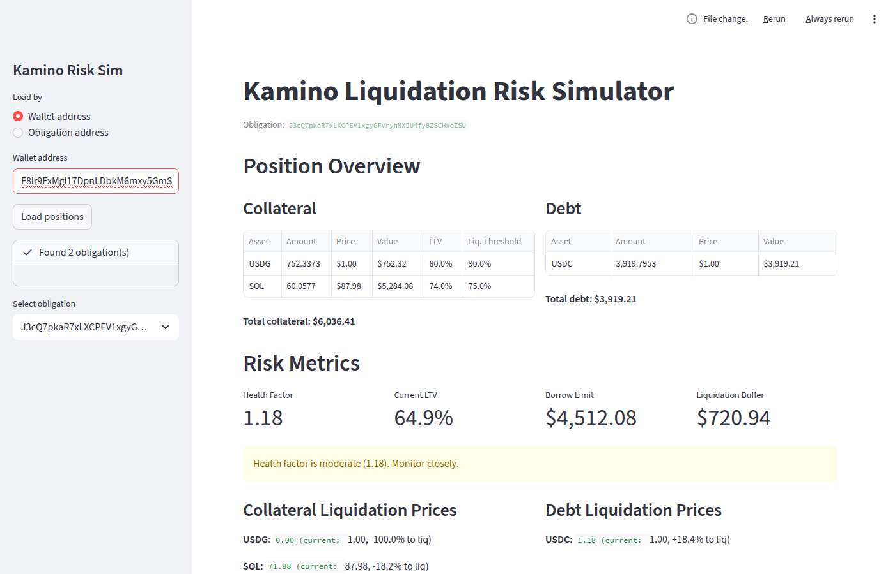
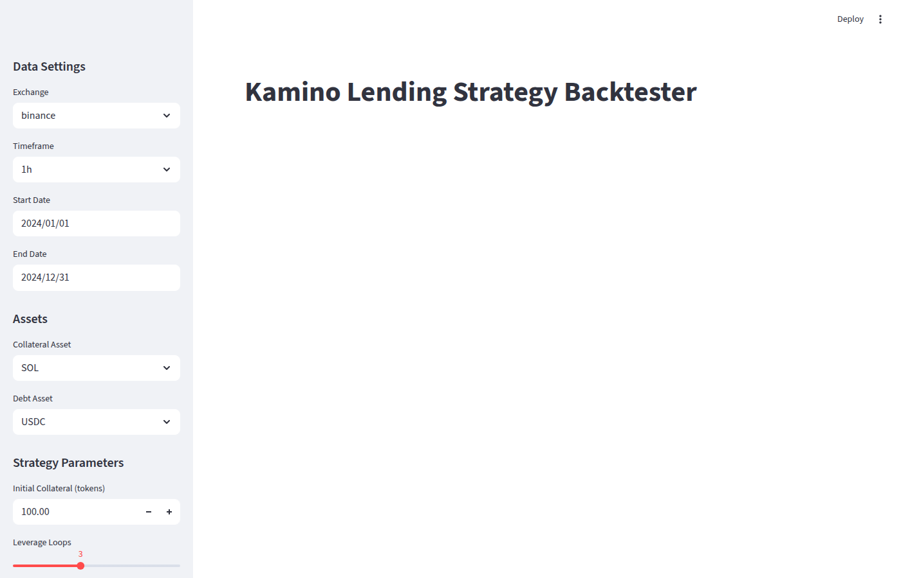

# CryptoLab

DeFi lending risk tools for [Kamino Finance](https://kamino.finance/) on Solana. Two main components:

1. **Liquidation Risk Simulator** — load real on-chain positions and stress-test them against price scenarios
2. **Strategy Backtester** — test leverage looping strategies against historical price data with realistic protocol mechanics

## Liquidation Risk Simulator

Load any Kamino lending obligation by wallet or obligation address. The simulator reads on-chain data via Solana RPC and decodes it using Kamino's IDL.



### Features

- **Live position loading** — fetches collateral, debt, prices, and LTV/liquidation thresholds directly from Solana mainnet
- **Risk metrics** — health factor, current LTV, borrow limit, liquidation buffer
- **Liquidation prices** — exact price levels at which each collateral or debt asset triggers liquidation, with percentage distance from current price
- **Scenario simulator** — drag sliders to simulate price changes, collateral adjustments, debt changes, and see how risk metrics respond in real time
- **Recovery actions** — three recovery options when health factor drops:
  - *Option A*: repay debt directly
  - *Option B*: withdraw collateral, swap to debt asset, repay
  - *Option C*: deposit additional collateral
- **Auto-loop** — simulate leverage loop iterations (borrow stablecoins, swap to collateral, deposit)
- **Collateral rebalance** — swap between collateral assets

### Usage

```bash
streamlit run kamino_app.py
```

## Strategy Backtester

Backtest DeFi lending strategies against historical price data from any ccxt-supported exchange. Models realistic Kamino protocol mechanics including liquidation penalties, interest accrual, and LST staking yields.



### Features

- **Historical OHLCV data** via ccxt (Binance, Bybit, OKX) with automatic CSV caching
- **Realistic protocol mechanics**:
  - Per-asset liquidation parameters (bonus scaling 2-10%, partial liquidation with 20% close factor)
  - Borrow interest accrual (configurable APY per asset)
  - LST staking yield simulation (JitoSOL/mSOL price appreciation)
  - Cascading liquidation with priority rules (lowest threshold collateral seized first)
- **Leverage loop strategy** with auto-rebalancing:
  - Configurable loops, utilization, and HF thresholds
  - Auto-delever when HF drops too low
  - Auto-relever when HF rises too high
- **Performance metrics**: Sharpe ratio, Sortino ratio, max drawdown, HF statistics, interest/yield tracking
- **Grid search optimizer** over strategy parameter combinations
- **Streamlit UI** with charts for portfolio value, health factor, prices, and liquidation events

### Usage

```bash
streamlit run backtest_app.py
```

### Writing Custom Strategies

Implement the `Strategy` ABC:

```python
from arblab.backtest.strategy import Strategy

class MyStrategy(Strategy):
    def setup(self, snapshot, config):
        # Build initial position (add collateral, debt)
        return snapshot

    def on_bar(self, snapshot, bar):
        # Return list of actions based on current state and prices
        # Actions: deposit_collateral, withdraw_collateral, borrow, repay
        return []

    def on_liquidation(self, snapshot, bar, event):
        # React to liquidation events (optional)
        return []
```

### Architecture

```
fetch_ohlcv() -> pd.DataFrame
                    |
    BacktestEngine.run(price_data, strategy_config, market_params)
                    |
          strategy.setup() -> initial AccountSnapshot
                    |
            +-- BAR LOOP ---------------------------------+
            | 1. Accrue borrow interest                    |
            | 2. Accrue LST staking yield (price drift)    |
            | 3. Update prices from bar close              |
            | 4. Check HF < 1.0 -> simulate liquidation    |
            | 5. strategy.on_bar() -> actions              |
            | 6. Apply actions                             |
            | 7. Record state                              |
            +----------------------------------------------+
                    |
          compute_metrics(history) -> PerformanceMetrics
```

## Project Structure

```
arblab/
    kamino_risk.py          # AccountSnapshot, apply_actions(), scenario_report()
    kamino_recovery.py      # Recovery calculation functions
    kamino_onchain.py       # Solana RPC + IDL decoding
    backtest/
        market.py           # AssetConfig, MarketParams, liquidation/interest mechanics
        strategy.py         # Strategy ABC, PriceBar, BarData
        engine.py           # BacktestEngine: main bar-by-bar loop
        metrics.py          # Sharpe, drawdown, PnL calculations
        results.py          # BacktestResult container
        data.py             # OHLCV fetching via ccxt with caching
        optimizer.py        # Grid search over parameter combinations
    strategies/
        leverage_loop.py    # SOL/JitoSOL leverage loop strategy

kamino_app.py               # Streamlit UI: liquidation risk simulator
backtest_app.py             # Streamlit UI: strategy backtester
```

## Setup

```bash
pip install -r requirements.txt
```

Create a `.env` file for configuration:

```
SOLANA_RPC_URL=https://api.mainnet-beta.solana.com
KAMINO_PROGRAM_ID=KLend2g3cP87fffoy8q1mQqGKjrxjC8boSyAYavgmjD
DEFAULT_WALLET=<your-wallet-address>
```

## Tests

```bash
# Run all tests (194 tests)
pytest -v

# Run only backtest tests
pytest tests/test_backtest_*.py -v

# Run only simulator tests
pytest tests/test_kamino_*.py tests/test_scenarios.py -v
```
